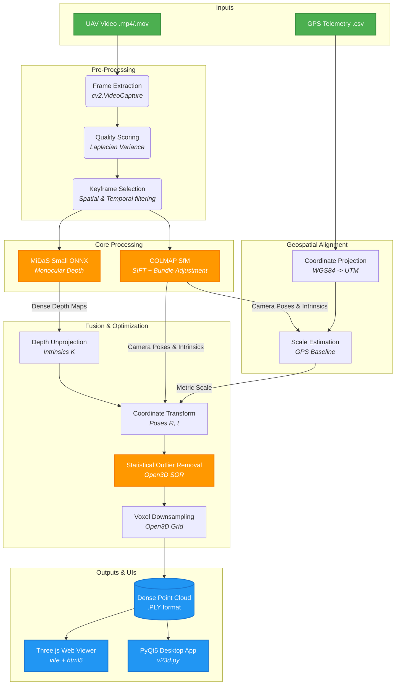

# AeroTwin (V23D) — Advanced Single-Pass UAV Video to 3D Model Generator

<p align="center">
  
  
  
  
  
  
</p>

AeroTwin (internally codenamed `V23D`) is an advanced computer vision and photogrammetry pipeline designed to convert a single UAV/drone video flyover into a dense, georeferenced, and scalable 3D point cloud model. By combining robust classical photogrammetry (SfM) with state-of-the-art Deep Learning (Monocular Depth Estimation), AeroTwin generates highly accurate 3D assets suitable for GIS mapping, digital twins, and simulation environments.

---

## 🏗️ 1. Complete System Architecture

The pipeline orchestrates multiple computational stages, passing data structurally from raw video down to a fused dense point cloud.



---

## ⚙️ 2. Detailed Algorithmic Workflow

The system is executed through `src/pipeline.py` which triggers a 7-stage process.

### Stage 1: Frame Extraction (`src/frame_extraction/extractor.py`)
- Reads the video file using `cv2.VideoCapture`.
- Target FPS is determined by `config.yaml` (default `2.0` FPS).
- Bound by `min_frames` (50) and `max_frames` (200) to ensure processing doesn't consume unbounded memory.

### Stage 2: Quality Scoring (`src/frame_extraction/quality.py`)
- Uses **Laplacian Variance** (`cv2.Laplacian`) to evaluate the sharpness of every frame.
- High variance indicates a sharp image with high-frequency details (ideal for SIFT features).
- Frames below a `blur_threshold` (100.0) are penalized.

### Stage 3: Keyframe Selection (`src/frame_extraction/selector.py`)
- Filters frames to maximize spatial coverage without redundancy.
- Integrates `gps_spacing_m` (default 2.0m) to enforce a baseline distance between frames if GPS telemetry is provided.

### Stage 4: Structure from Motion (COLMAP) (`src/sfm/colmap_wrapper.py`)
- **Feature Extraction**: Triggers COLMAP to extract SIFT features.
- **Feature Matching**: Uses sequential matching (`matcher_type: "sequential"`) with an overlap of 10 frames to optimize computation.
- **Sparse Reconstruction**: Performs incremental Bundle Adjustment (BA), refining focal lengths and extra parameters (`ba_refine_extra_params: true`).
- **Outputs**: Sparse 3D points, intrinsic matrices (`K`), and extrinsic poses (Rotation `R`, Translation `t`).

### Stage 5: Dense Depth Estimation (`src/depth/estimator.py`)
- Utilizes **Depth Anything V2** (configured as `vitl`) or **MiDaS Small ONNX** model.
- Because SfM struggles with textureless surfaces (sky, water, flat roads), neural monocular depth provides dense structural understanding.
- Runs inference on batches (`batch_size: 4`) scaling images to `input_size: 518`.

### Stage 6: Geospatial Alignment (`src/geospatial/`)
- Maps local arbitrary COLMAP coordinates to real-world WGS84 coordinates.
- **`coordinate.py`**: Handles EPSG:4326 to UTM projection.
- **`gps_alignment.py` / `metric_scale.py`**: Computes the rigid 3D transformation (Scale, Rotation, Translation) between the SfM camera centers and the drone's GPS logs using Procrustes analysis.

### Stage 7: Depth Fusion & Meshing (`src/reconstruction/fusion.py`)
1. **Depth Unprojection**: 2D depth maps are unprojected to 3D space using the solved intrinsic matrix $K$: 
   $Z = \text{depth}(u, v)$
   $X = (u - c_x) \times \frac{Z}{f_x}$
   $Y = (v - c_y) \times \frac{Z}{f_y}$
2. **Coordinate Transformation**: Points are transformed into the unified world space using extrinsic poses $P = R \times p_{cam} + t$.
3. **Filtering**: `Open3D` applies Statistical Outlier Removal (SOR, 20 neighbors, std ratio 2.0) to remove floating noise.
4. **Voxel Grid Downsampling**: The massive point cloud is downsampled (voxel size `0.05m`) to balance density and performance.

---

## 📊 3. Confidence Estimation Algorithm

Located in `src/confidence/estimator.py`, this is a unique feature of AeroTwin that scores the reliability of every generated 3D point.

**Weighted Confidence Metrics:**
- `observation_weight` (0.3): Number of cameras that see the point.
- `reprojection_weight` (0.3): Distance between the projected 3D point and the 2D feature.
- `depth_consistency_weight` (0.2): Variance of the depth value across overlapping frames.
- `gps_residual_weight` (0.2): Confidence derived from the GPS alignment residual error.

The output point cloud is saved as `confidence.ply`, where point colors map to confidence values:
- 🟢 **High (>66%)**: Solid structures observed from multiple angles.
- 🟡 **Medium (33-66%)**: Edges or slightly occluded regions.
- 🔴 **Low (<33%)**: Flying pixels, sky, or moving objects.

---

## 🖥️ 4. Application Interfaces

### A. The PyQt5 Desktop Application (`v23d.py`)
The primary interface for executing the pipeline on a local machine.
- **Modern QSS Styling**: Implements a dark-mode, glassmorphism theme using advanced Qt Style Sheets.
- **Threading**: Uses `QThread` (`ReconstructionWorker`) to prevent UI blocking during heavy processing.
- **Real-Time OpenGL Viewer**: `GLViewer(QGLWidget)` utilizes raw `OpenGL` Vertex Buffer Objects (VBOs) via `glDrawArrays` to instantly render millions of points efficiently.
- **Preview Tabs**: Uses `QTabWidget` to display mid-processing outputs (Source Frames vs. MiDaS Depth color maps).

### B. The Hardware-Accelerated Web Viewer (`viewer/`)
For sharing and web visualization, powered by **Vite** and **Three.js**.
- **Tech Stack**: `HTML5`, `CSS3` (Glassmorphism UI), `Three.js` (WebGL engine).
- **Core Loop (`src/main.js`)**:
  - Utilizes `PLYLoader` to parse `.ply` geometry into `THREE.BufferGeometry`.
  - Sets up `OrbitControls` with damping for smooth cinematic rotation.
- **Measurement Tool**: Implements `THREE.Raycaster` projecting from the camera to the Point Cloud geometry. Clicking two points calculates the real-world metric Euclidean distance between them (since the model is metrically scaled via GPS).
- **Styling**: `index.html` uses `#0f172a` slate themes, backdrop filters for frosted glass panels, and CSS animations.

---

## 🎛️ 5. Hyperparameter Configuration (`config/default.yaml`)

The pipeline behaviour is deeply configurable via `config/default.yaml`.

| Section | Parameter | Default | Effect |
| :--- | :--- | :--- | :--- |
| `frame_extraction` | `blur_threshold` | 100.0 | Minimum Laplacian variance. Lowering this admits blurrier frames. |
| `frame_extraction` | `target_fps` | 2.0 | Sample rate from video. Higher = more processing time, denser cloud. |
| `sfm` | `matcher_type` | "sequential" | "exhaustive" tests all pairs, "sequential" assumes video format (faster). |
| `depth` | `batch_size` | 4 | Batch size for ONNX inference. Adjust based on GPU VRAM. |
| `reconstruction` | `voxel_size` | 0.05 | Point cloud density in meters. `0.05` means points are 5cm apart. |
| `reconstruction` | `depth_trunc` | 50.0 | Max reliable depth distance in meters. Pixels further away are ignored. |

---

## 📁 6. Complete Directory Structure

```text
SIH/
├── v23d.py                  # PyQt5 Desktop Entry Point
├── V23D.bat                 # Windows execution script
├── pyproject.toml           # Python package definition (Dependencies)
├── README.md                # System documentation
├── config/
│   └── default.yaml         # Core hyperparameters
├── models/
│   └── midas_small.onnx     # Deep Learning Depth Model Weights
├── scripts/
│   ├── run_pipeline.py      # CLI tool (argparse wrapper for src/pipeline.py)
│   ├── run_demo.py          # Demo runner for test assets
│   ├── generate_synthetic.py# Tool for creating synthetic test data
│   └── reconstruct_terrain.py # Terrain specific reconstruction script
├── src/                     # Core Processing Logic
│   ├── pipeline.py          # Master Orchestrator Class
│   ├── confidence/          # Statistical confidence grading module
│   ├── depth/               # MiDaS ONNX Inference runner
│   ├── frame_extraction/    # Video decoding and Laplacian scoring
│   ├── geospatial/          # EPSG/UTM projections and Procrustes alignment
│   ├── reconstruction/      # 3D unprojection, Depth Fusion, Open3D SOR
│   ├── sfm/                 # COLMAP Subprocess caller and Pose Graph
│   ├── utils/               # General I/O and metadata logging
│   └── viewer_server.py     # Flask backend for serving models to Web UI
├── tests/                   # PyTest Suite
│   ├── test_frame_extraction.py
│   ├── test_geospatial.py
│   └── test_pipeline.py
└── viewer/                  # Three.js Web Application
    ├── index.html           # Premium Glass UI Document
    ├── package.json         # Node scripts & Vite/Threejs dependencies
    ├── vite.config.js       # Bundler settings
    └── src/
        └── main.js          # WebGL rendering, PLY Loading, and Raycasting
```

---

## 🚀 7. Setup & Execution Instructions

### A. System Requirements
- **OS**: Windows 10/11, Ubuntu 20.04+, macOS 12+
- **Python**: `3.10` or higher
- **COLMAP**: You MUST install [COLMAP](https://colmap.github.io/install.html) and add it to your system `PATH`.
- **Node.js**: (Optional) Required only if you want to modify the Web Viewer.

### B. Python Environment Setup
We highly recommend using a Virtual Environment.

```bash
# 1. Initialize virtual environment
python -m venv venv

# 2. Activate it
# On Windows:
venv\Scripts\activate
# On Unix:
source venv/bin/activate

# 3. Install the project in editable mode (installs all deps from pyproject.toml)
pip install -e .
```

### C. Running via GUI (Recommended)
You can launch the PyQt5 GUI using the provided batch script or directly via python.
```bash
# Double click V23D.bat or run:
python v23d.py
```
- Click **"Browse Video"**, select your UAV drone footage.
- Click **"Generate 3D Model"**.
- Monitor the tabs as depth maps are generated.
- The 3D view will populate automatically when finished.

### D. Running via CLI (For Servers/Headless)
Execute the pipeline via command line using the custom script.
```bash
aerotwin path/to/drone_video.mp4 --output ./my_model --viewer
```
- `--gps path/to/telemetry.csv`: Inject GPS logs for metric scaling.
- `--no-depth`: Skips AI depth estimation, relying solely on COLMAP sparse points.
- `--viewer`: Automatically spins up `src/viewer_server.py` and opens your browser when done.

### E. Launching the Web Viewer Manually
To view any `.ply` file in your browser with measurement tools:
```bash
cd viewer
npm install
npm run dev
```
Open `http://localhost:5173`. Drag and drop your generated `.ply` file into the browser window.

---

<p align="center">
  <i>Developed for Advanced Geospatial Analytics and 3D Scene Reconstruction.</i>
</p>
