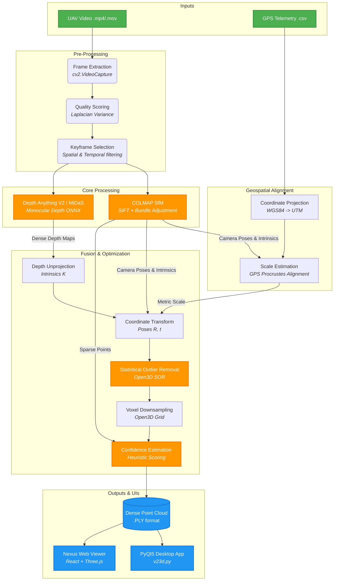
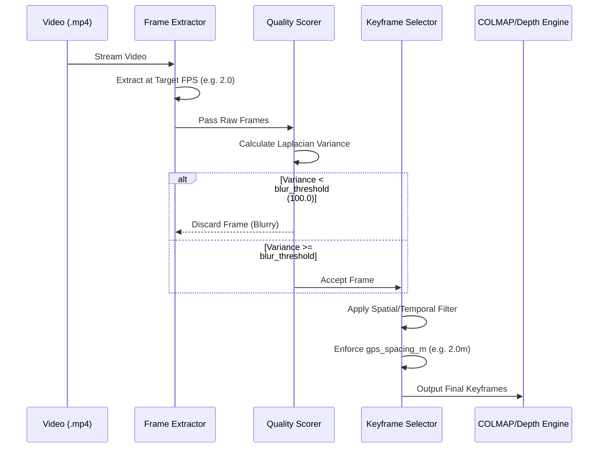
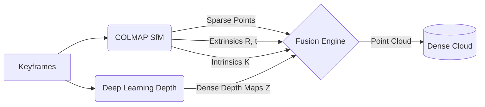

# AeroVision (V23D) GÇö Advanced Single-Pass UAV Video to 3D Model Generator

<p align="center">
  
  
  
  
  
  
  
</p>

AeroVision (internally codenamed `V23D`) is an advanced computer vision and photogrammetry pipeline designed to convert a single UAV/drone video flyover into a dense, georeferenced, and scalable 3D point cloud model. By combining robust classical photogrammetry (SfM) with state-of-the-art Deep Learning (Monocular Depth Estimation), AeroVision generates highly accurate 3D assets suitable for GIS mapping, digital twins, and simulation environments.

---

## =ƒÅùn+Å 1. Complete System Architecture

The pipeline orchestrates multiple computational stages, passing data structurally from raw video down to a fused dense point cloud.



---

## GÜÖn+Å 2. Detailed Algorithmic Workflow

The system is executed through `src/pipeline.py` which triggers a rigorous 7-stage process. 

### Stage 1, 2, & 3: Frame Intelligence

To optimize computation, we do not process every frame of a 60FPS video. Instead, we intelligently select the best frames that provide maximum spatial coverage.



- **Frame Extraction (`extractor.py`)**: Bound by `min_frames` (50) and `max_frames` (200) to ensure predictable memory consumption.
- **Quality Scoring (`quality.py`)**: Uses **Laplacian Variance** (`cv2.Laplacian`) to evaluate image sharpness.
- **Keyframe Selection (`selector.py`)**: Prevents redundant processing while maintaining necessary overlap for SfM matching.

### Stage 4 & 5: Core Scene Understanding

This is the dual-engine core of AeroVision. It combines classical geometry with modern AI.



- **COLMAP (`colmap_wrapper.py`)**: 
  - Uses sequential matching (`matcher_type: "sequential"`) assuming video frame continuity.
  - Performs incremental Bundle Adjustment (BA) to solve for camera poses (Extrinsics) and focal lengths (Intrinsics).
- **Depth Estimation (`estimator.py`)**:
  - Utilizes **Depth Anything V2** (`vitl`) or **MiDaS Small ONNX**.
  - Provides structural understanding for textureless surfaces (water, roads) where COLMAP's SIFT features typically fail.

### Stage 6: Geospatial Alignment
- Translates arbitrary local coordinates into real-world geographic coordinates.
- Projects EPSG:4326 (Lat/Lon) to UTM.
- Calculates a rigid 3D transformation (Scale, Rotation, Translation) between SfM camera centers and GPS logs using **Procrustes Analysis**.

### Stage 7: Depth Fusion & Optimization
- **Unprojection**: Reconstructs 3D coordinates from 2D pixels using the intrinsic matrix $K$.
- **Coordinate Transformation**: Moves points into the world space using the solved extrinsics.
- **Filtering**: Open3D's Statistical Outlier Removal (SOR) cleans up floating noise.
- **Voxel Grid Downsampling**: A voxel grid (e.g., `0.05m`) homogenizes the point density.

---

## =ƒôè 3. Confidence Estimation Algorithm

A unique feature of AeroVision (`src/confidence/estimator.py`) is its ability to score the physical reliability of every generated 3D point.

**Heuristic Confidence Function:**

$C = 0.3(W_{obs}) + 0.3(W_{reproj}) + 0.2(W_{depth}) + 0.2(W_{gps})$

- $W_{obs}$: Observation weight (How many cameras see this point?)
- $W_{reproj}$: Reprojection error (Distance between projected 3D point and 2D feature)
- $W_{depth}$: Depth consistency (Variance of the AI depth value across overlapping frames)
- $W_{gps}$: GPS residual weight (Error in Procrustes alignment)

Output is stored in `confidence.ply`:
- =ƒƒó **High (>66%)**: Solid, multi-view verified structures.
- =ƒƒí **Medium (33-66%)**: Edges or partially occluded regions.
- =ƒö¦ **Low (<33%)**: Unreliable geometry (sky, moving cars, noise).

---

## =ƒûÑn+Å 4. Application Interfaces

### A. The PyQt5 Desktop Application (`v23d.py`)
The primary offline processing GUI.
- **Architecture**: Separates UI from processing using `QThread` (`ReconstructionWorker`).
- **Rendering**: Implements a high-performance `GLViewer(QGLWidget)` using raw OpenGL VBOs via `glDrawArrays` to render millions of points in real-time.
- **Styling**: Modern dark-mode glassmorphism via advanced Qt Style Sheets.

### B. Nexus Web Gateway & 3D Viewer (`viewer/`)
The premium, hardware-accelerated web interface powered by **Vite, React, and Three.js**.

- **The Nexus Gateway (`gateway-flow.tsx`)**: 
  - Serves as the high-end entrance/authentication UI for the platform.
  - Built with React and GSAP, featuring a dynamic HTML5 canvas particle flow system mimicking data routing and distributed consensus.
  - Integrates interactive `threeui-controls` for realtime visual adjustments (speed, density, dark/light modes).
- **Core WebGL Viewer (`main.js` / `demo.tsx`)**:
  - Implements `THREE.BufferGeometry` via `PLYLoader` for efficient rendering.
  - Includes a `THREE.Raycaster` based measurement tool allowing users to calculate real-world Euclidean distances between points (leveraging the GPS metric scale).

---

## =ƒôü 5. Complete Directory Structure

```text
SIH/
Gö£GöÇGöÇ v23d.py                  # PyQt5 Desktop Entry Point
Gö£GöÇGöÇ V23D.bat                 # Windows execution script
Gö£GöÇGöÇ pyproject.toml           # Python package definition
Gö£GöÇGöÇ README.md                # Detailed System documentation
Gö£GöÇGöÇ config/
Göé   GööGöÇGöÇ default.yaml         # Core hyperparameters (SfM, Extractor, Fusion)
Gö£GöÇGöÇ models/
Göé   GööGöÇGöÇ midas_small.onnx     # Deep Learning Depth Model Weights
Gö£GöÇGöÇ scripts/
Göé   GööGöÇGöÇ run_pipeline.py      # Headless CLI orchestrator
Gö£GöÇGöÇ src/                     # Core Processing Logic
Göé   Gö£GöÇGöÇ pipeline.py          # Master Orchestrator (7-stages)
Göé   Gö£GöÇGöÇ confidence/          # Heuristic confidence grading
Göé   Gö£GöÇGöÇ depth/               # ONNX Depth inference
Göé   Gö£GöÇGöÇ frame_extraction/    # Laplacian scoring and selection
Göé   Gö£GöÇGöÇ geospatial/          # EPSG/UTM and Procrustes alignment
Göé   Gö£GöÇGöÇ reconstruction/      # Unprojection and Open3D voxelization
Göé   Gö£GöÇGöÇ sfm/                 # COLMAP Subprocess and Pose Graph
Göé   GööGöÇGöÇ viewer_server.py     # Local model server backend
GööGöÇGöÇ viewer/                  # React + Three.js Web Application
    Gö£GöÇGöÇ package.json         # Node dependencies
    Gö£GöÇGöÇ vite.config.js       # Bundler settings
    GööGöÇGöÇ src/
        Gö£GöÇGöÇ main.js          # WebGL rendering and PLY Loading
        GööGöÇGöÇ components/
            GööGöÇGöÇ ui/
                Gö£GöÇGöÇ demo.tsx         # Gateway UI demo wrapper
                GööGöÇGöÇ gateway-flow.tsx # React/GSAP particle visualization
```

---

## =ƒÄ¢n+Å 6. Hyperparameter Configuration (`config/default.yaml`)

Tuning these parameters dictates the balance between processing speed and 3D model quality.

| Section | Parameter | Default | Effect |
| :--- | :--- | :--- | :--- |
| `frame_extraction` | `blur_threshold` | 100.0 | Lowering admits blurrier frames (useful for fast drone speeds). |
| `frame_extraction` | `target_fps` | 2.0 | Higher = more overlap, denser cloud, exponentially slower SfM. |
| `sfm` | `matcher_type` | "sequential" | "sequential" expects video order. Use "exhaustive" for unordered photos. |
| `depth` | `batch_size` | 4 | ONNX inference batch size. Increase if you have high VRAM. |
| `reconstruction` | `voxel_size` | 0.05 | Point distance in meters. `0.05` = 5cm resolution. |
| `reconstruction` | `depth_trunc` | 50.0 | Max distance (m) to trust depth AI. Clips sky and far backgrounds. |

---

## =ƒÜÇ 7. Setup & Execution Instructions

### A. System Requirements
- **OS**: Windows 10/11, Ubuntu 20.04+, macOS 12+
- **Python**: `3.10` or higher
- **COLMAP**: You MUST install [COLMAP](https://colmap.github.io/install.html) and add it to your system `PATH`.
- **Node.js**: Required to run the Nexus Web Gateway.

### B. Environment Setup
```bash
# 1. Virtual environment
python -m venv venv
venv\Scripts\activate  # Windows
# source venv/bin/activate # Unix

# 2. Install dependencies
pip install -e .
```

### C. Running the Pipeline
**Via GUI:**
```bash
python v23d.py
```
- Click **"Browse Video"**, select your UAV drone footage, and click **"Generate 3D Model"**.

**Via CLI (Headless):**
```bash
AeroVision path/to/drone_video.mp4 --gps path/to/telemetry.csv --output ./my_model
```

### D. Launching the Nexus Web Viewer
To interact with the new React UI and view `.ply` models:
```bash
cd viewer
npm install
npm run dev
```
Navigate to `http://localhost:5173`.

### GÜán+Å Common Troubleshooting
- **COLMAP Errors**: Ensure typing `colmap` in your terminal launches the program. If not, add the COLMAP installation directory to your System Environment Variables (`PATH`).
- **CUDA OOM (Out of Memory)**: If the pipeline crashes during the depth stage, lower `batch_size: 2` in `config/default.yaml`.
- **No Dense Cloud Generated**: This usually implies the SfM matching failed. Try reducing `blur_threshold` or increasing `target_fps` to ensure frames overlap sufficiently.

---

<p align="center">
  <i>Developed for Advanced Geospatial Analytics and 3D Scene Reconstruction.</i>
</p>
